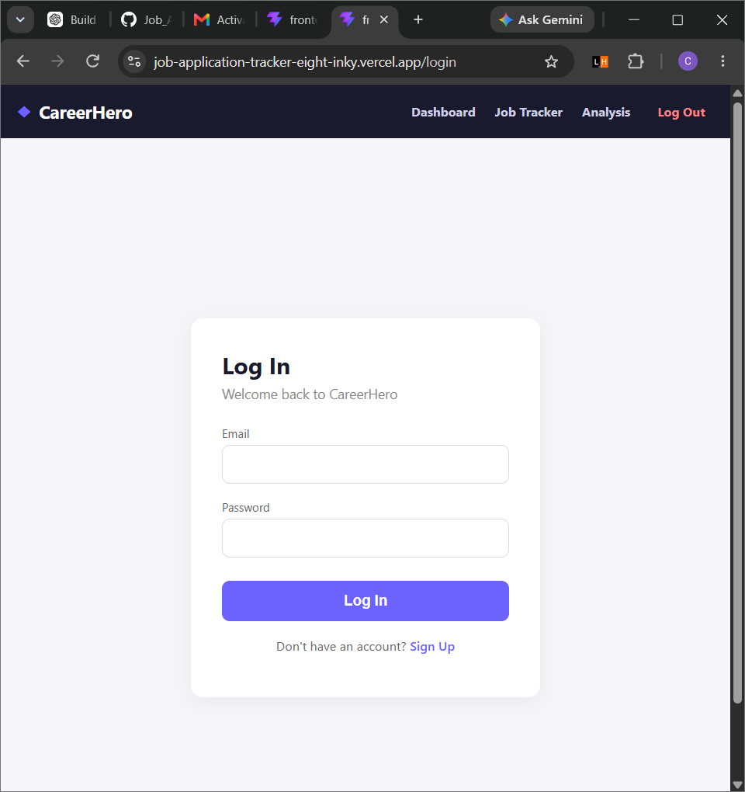
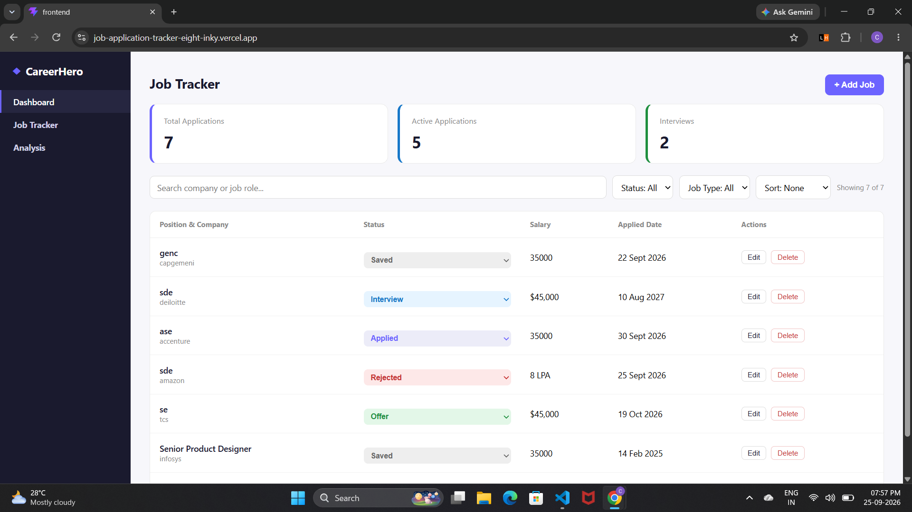
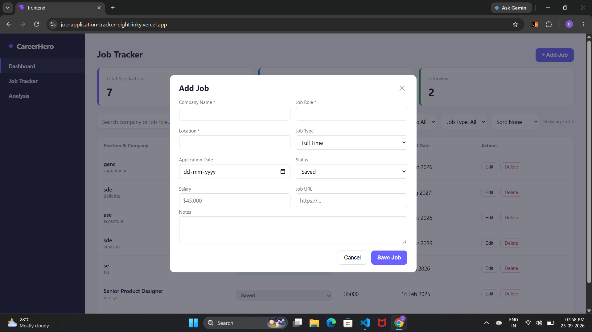
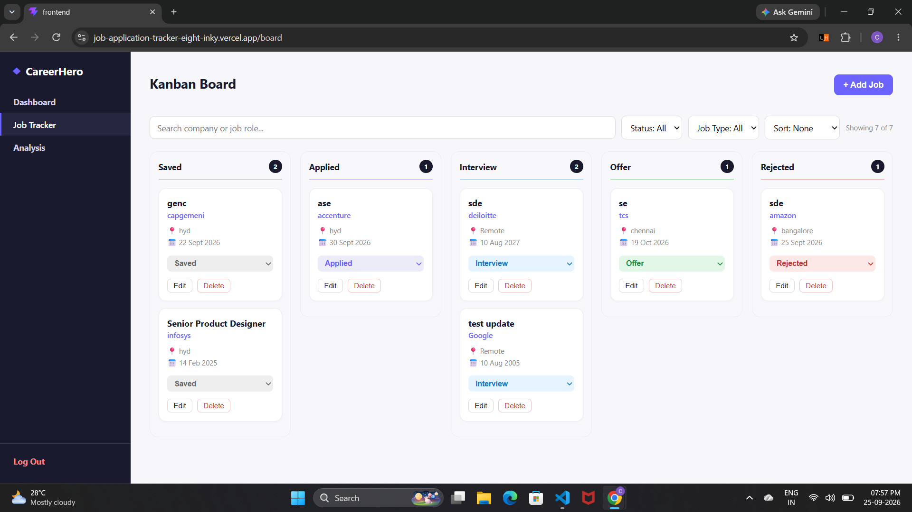
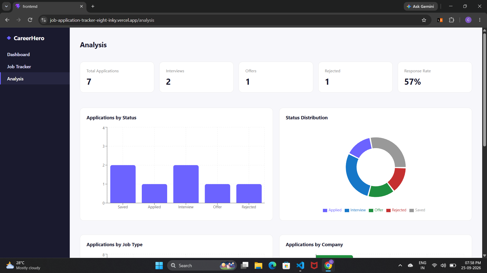

# 💼 Job Application Tracker

A full-stack web application that helps users organize, track, and analyze their job applications from a single dashboard.

The application provides a centralized way to manage job applications, monitor application progress, track interviews and offers, and visualize application statistics.

🔗 **Live Demo:** https://job-application-tracker-eight-inky.vercel.app/

---

## ✨ Features

### 🔐 Authentication

* User Signup and Login
* JWT-based authentication
* Protected application data
* User-specific job records
* Logout functionality

### 📊 Dashboard

* Total applications
* Active applications
* Interview count
* Dynamic application statistics
* Quick overview of the job search

### 📋 Job Management

* Add new job applications
* Edit existing applications
* Delete applications
* View complete job details
* Track company, position, status, job type and other application information

### 🗂️ Kanban Board

Applications can be organized based on their current status:

* Saved
* Applied
* Interview
* Offer
* Rejected

### 🔎 Search & Filtering

* Search applications
* Filter by application status
* Filter by job type
* Sort and organize applications

### 📈 Application Analysis

* Visual representation of application statistics
* Track Applied, Interview, Offer and Rejected applications
* Charts for understanding job-search progress

### 📱 Responsive Interface

* Clean and modern user interface
* Responsive layout
* Dashboard, Board and Analysis views
* Designed for desktop and smaller screens

---

## 🛠️ Tech Stack

### Frontend

* **React.js**
* **Vite**
* **JavaScript**
* **HTML5**
* **CSS3**
* **React Router**

### Backend

* **Node.js**
* **Express.js**
* **REST API**
* **JWT Authentication**
* **bcryptjs**

### Database

* **MongoDB**
* **MongoDB Atlas**
* **Mongoose**

### Deployment

* **Vercel** — Frontend
* **Render** — Backend
* **MongoDB Atlas** — Database

### Development Tools

* **Visual Studio Code**
* **Git**
* **GitHub**
* **Postman** / API testing tools

---

## 🏗️ Project Architecture

```text
                    ┌─────────────────────┐
                    │       User          │
                    └──────────┬──────────┘
                               │
                               ▼
                    ┌─────────────────────┐
                    │ React + Vite        │
                    │     Frontend        │
                    └──────────┬──────────┘
                               │
                         REST API Calls
                               │
                               ▼
                    ┌─────────────────────┐
                    │ Node.js + Express   │
                    │      Backend        │
                    └──────────┬──────────┘
                               │
                    JWT Authentication
                               │
                               ▼
                    ┌─────────────────────┐
                    │   MongoDB Atlas     │
                    │      Database       │
                    └─────────────────────┘
```

---

## 📂 Project Structure

```text
Job_Application_Tracker/
│
├── frontend/
│   ├── src/
│   │   ├── components/
│   │   ├── pages/
│   │   ├── utils/
│   │   ├── App.jsx
│   │   └── main.jsx
│   │
│   ├── public/
│   ├── .env
│   ├── package.json
│   └── vite.config.js
│
├── backend/
│   ├── middleware/
│   │   └── auth.js
│   ├── models/
│   │   ├── User.js
│   │   └── jobs.js
│   ├── server.js
│   ├── .env
│   └── package.json
│
├── .gitignore
└── README.md
```

---

# 🚀 Getting Started

Follow these steps to run the project locally.

## 1. Clone the Repository

```bash
git clone https://github.com/anjalichavvakula586/Job_Application_Tracker.git
```

Move into the project directory:

```bash
cd Job_Application_Tracker
```

---

# 🖥️ Frontend Setup

Open a terminal and move into the frontend directory:

```bash
cd frontend
```

Install dependencies:

```bash
npm install
```

Create a `.env` file inside the `frontend` folder:

```env
VITE_API_URL=http://localhost:5000
```

Start the development server:

```bash
npm run dev
```

The frontend will normally run at:

```text
http://localhost:5173
```

---

# ⚙️ Backend Setup

Open another terminal.

Move into the backend directory:

```bash
cd backend
```

Install dependencies:

```bash
npm install
```

Create a `.env` file inside the `backend` folder:

```env
MONGO_URI=your_mongodb_connection_string
JWT_SECRET=your_jwt_secret
```

Start the backend:

```bash
npm start
```

The backend will run at:

```text
http://localhost:5000
```

You should see messages similar to:

```text
Server running on http://localhost:5000
MongoDB connected successfully
```

---

# 🗄️ MongoDB Setup

This project uses **MongoDB Atlas** as its cloud database.

To run the project locally:

1. Create a MongoDB Atlas account.
2. Create a database cluster.
3. Create a database user.
4. Allow your IP address in Network Access.
5. Copy the MongoDB connection string.
6. Add it to the backend `.env` file.

Example:

```env
MONGO_URI=mongodb+srv://<username>:<password>@<cluster-url>/<database-name>
JWT_SECRET=your_secret_key
```

⚠️ **Never commit `.env` files or database credentials to GitHub.**

---

# 🔑 Environment Variables

### Frontend

```env
VITE_API_URL=http://localhost:5000
```

For production, the frontend uses the deployed backend URL.

### Backend

```env
MONGO_URI=your_mongodb_connection_string
JWT_SECRET=your_jwt_secret
```

Environment files are excluded from Git using `.gitignore`.

---

# 🔄 How the Application Works

### 1. User Registration

A new user creates an account through the Signup page.

### 2. Authentication

The backend validates the credentials and generates a JWT token.

### 3. Login

The frontend stores the authentication token and uses it for protected API requests.

### 4. Job Management

Authenticated users can:

```text
Add → View → Edit → Delete
```

their own job applications.

### 5. Status Tracking

Applications can move through different stages:

```text
Saved → Applied → Interview → Offer
                         ↓
                      Rejected
```

### 6. Dashboard & Analysis

The application calculates and displays statistics based on the user's job applications.

---

# 🌐 Deployment

The application is deployed using separate frontend and backend services.

### Frontend

**Vercel**

Live application:

https://job-application-tracker-eight-inky.vercel.app/

### Backend

**Render**

Backend API:

https://job-application-tracker-backend-otkd.onrender.com/

### Database

**MongoDB Atlas**

The database is hosted remotely using MongoDB Atlas.

---

# 🧪 Local Development

To run the complete application locally:

### Terminal 1 — Backend

```bash
cd backend
npm install
npm start
```

### Terminal 2 — Frontend

```bash
cd frontend
npm install
npm run dev
```

Then open:

```text
http://localhost:5173
```

---

# 📸 Application Screens

### 🔐 Login



### 📊 Dashboard



### ➕ Add Job



### 📋 Job Board



### 📈 Analysis


---

# 🔒 Security

* JWT-based authentication
* Password hashing using bcrypt
* Protected backend routes
* User-specific job data
* Sensitive environment variables stored in `.env`
* `.env` files excluded from Git

---

# 🎯 Project Goals

This project was developed to provide a practical solution for managing job applications while demonstrating full-stack web development concepts including:

* Frontend development with React
* REST API development
* Authentication and authorization
* CRUD operations
* Database integration
* State management
* Search and filtering
* Data visualization
* Cloud deployment

---

# 🔮 Future Improvements

Possible improvements for future versions include:

* Resume management
* Application reminders
* Email notifications
* Advanced analytics
* Pagination
* Job description tracking
* Calendar integration

---
sample credentials to login:
email:anjalichavvakula50@gmail.com
password:123456789

# 👩‍💻 Author

**Anjali Chavvakula**

B.Tech Computer Science & Engineering

GitHub:
https://github.com/anjalichavvakula586

---

## ⭐ If you find this project useful

Feel free to explore the repository and try the live application.

⭐ Star the repository if you find it helpful!
